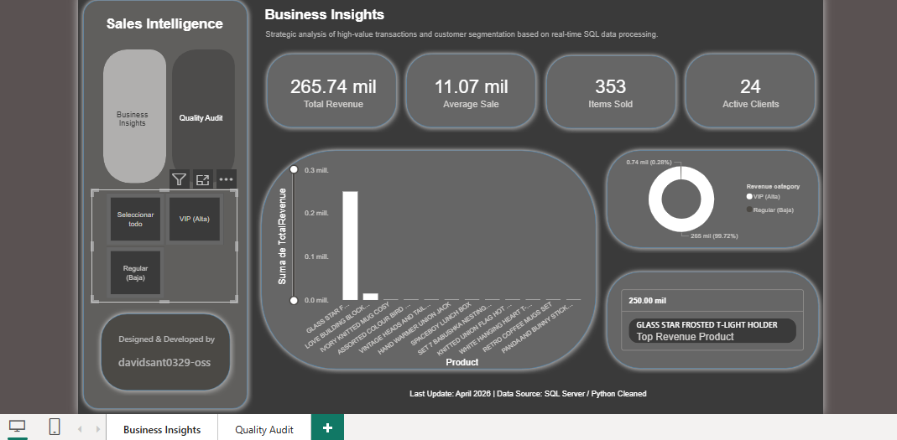
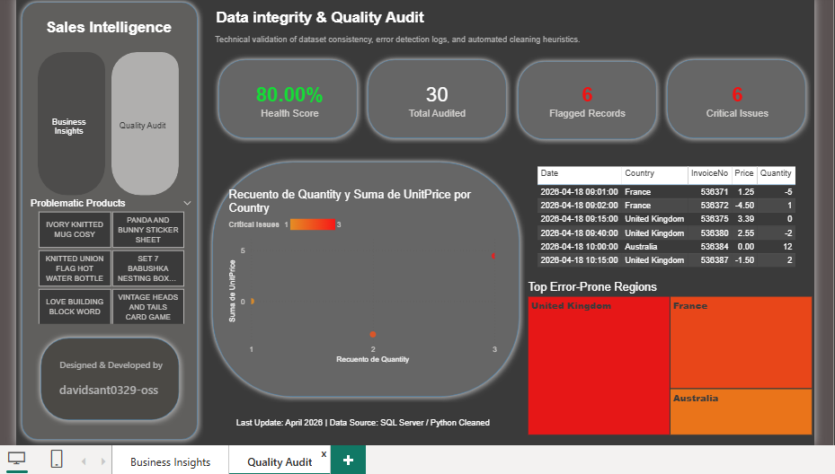
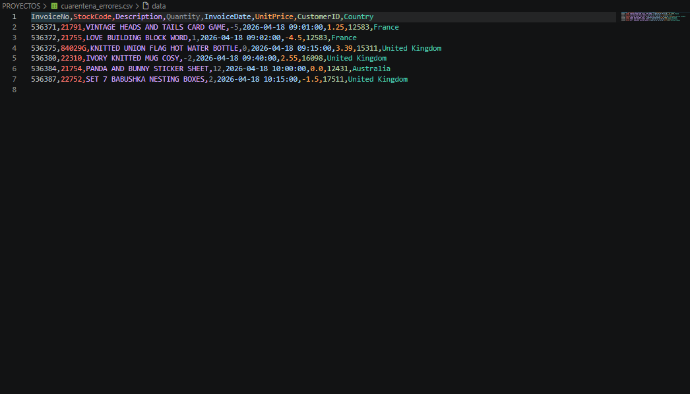

# 🛠️ Data Quality Audit & Interactive Monitoring System

---

## 🇺🇸 English Version

### 📌 Project Overview
This project is dedicated to **Data Governance and Quality Assurance**. I developed a robust system that identifies, segregates, and analyzes data inconsistencies in a retail environment. The goal is to ensure that business decisions are based only on high-integrity information.

### 🏗️ 1. Dual-Stream ETL & SQL Automation (Python)
* **Smart Filtering:** I developed a Python script that acts as an intelligent gatekeeper. Instead of deleting errors, the system generates two separate outputs: `clean_data.csv` (business-ready) and `dirty_data.csv` (failed records for auditing).
* **Automated SQL Injection:** Created an automation script that establishes a secure connection to **SQL Server**, automatically uploading the processed data into the database.
* **Error Classification:** The pipeline automatically detects negative prices, incoherent quantities, and missing IDs, categorizing them before storage.

### 📊 2. Advanced Power BI Features
* **Product Error Navigator:** A custom UI using slicer buttons to instantly filter the top 6 products with the highest inconsistency rates.
* **Anomaly Detection (Scatter Plot):** Built a visual tool to identify extreme outliers in Price vs. Quantity, highlighting financial risks.
* **Professional Navigation:** Integrated a seamless menu system to switch between Business Insights and the Technical Audit dashboard.

### 🛠️ Tech Stack
* **Python** (Pandas, SQLAlchemy) | **SQL Server** (T-SQL) | **Power BI** (UX/UI & DAX)

---

## 🇪🇸 Versión en Español

### 📌 Resumen del Proyecto
Este proyecto está dedicado al **Gobierno de Datos y el Aseguramiento de Calidad (QA)**. Desarrollé un sistema robusto que identifica, segrega y analiza inconsistencias de datos en un entorno de retail. El objetivo es garantizar que las decisiones de negocio se basen únicamente en información de alta integridad.

### 🏗️ 1. ETL de Flujo Dual y Automatización SQL (Python)
* **Filtrado Inteligente:** Desarrollé un script de Python que actúa como un filtro inteligente. En lugar de borrar errores, el sistema genera dos salidas: `clean_data.csv` (listo para el negocio) y `dirty_data.csv` (registros fallidos para auditoría).
* **Inyección Automatizada a SQL:** Creé un script de automatización que establece una conexión segura con **SQL Server**, cargando automáticamente los datos procesados en la base de datos.
* **Clasificación de Errores:** El pipeline detecta automáticamente precios negativos, cantidades incoherentes y IDs faltantes, clasificándolos por tipo de error antes de la carga.

### 📊 2. Funcionalidades Avanzadas en Power BI
* **Navegador de Errores por Producto:** Interfaz personalizada con botones para filtrar instantáneamente los 6 productos con mayores tasas de inconsistencia.
* **Detección de Anomalías (Scatter Plot):** Visualización diseñada para identificar valores atípicos en Precio vs. Cantidad, resaltando riesgos financieros.
* **Navegación Profesional:** Sistema de menús integrado para una transición fluida entre el análisis de negocio y la auditoría técnica.

### 🛠️ Tecnologías Utilizadas
* **Python** (Pandas, SQLAlchemy) | **SQL Server** (T-SQL) | **Power BI** (UX/UI y DAX)

---
> **Project Goal:** Moving from "just data" to **Trusted Data**. 🛡️

## 🖼️ Dashboard & Data Evidence / Galería y Evidencia

### 🔍 Quality & Insights Overview
*Visualización del sistema de auditoría y los resultados de negocio tras el filtrado de datos.*

| 📊 1. Business Insights | 🛡️ 2. Quality Audit |
| :---: | :---: |
|  |  |
| *Vista ejecutiva de los datos ya procesados y limpios.* | *Dashboard técnico de monitoreo de errores y salud de datos.* |

### 📂 3. Quarantined Data (Dirty CSV)
*Evidencia del archivo generado por el script de Python que contiene los registros rechazados por inconsistencias.*

| 📁 Failed Records Log |
| :---: |
|  |
| *Registros con IDs nulos, precios negativos o cantidades incoherentes detectados automáticamente.* |

---

### ⚙️ Pipeline Workflow / Flujo del Pipeline
1. **Source:** Dataset original con ruidos e inconsistencias.
2. **Python Filter:** Script de limpieza que bifurca la data.
3. **Storage:** Carga automática a SQL Server (Tablas de Producción vs. Tablas de Auditoría).
4. **Visualization:** Dashboards dinámicos para gestión de ventas y control de calidad.
